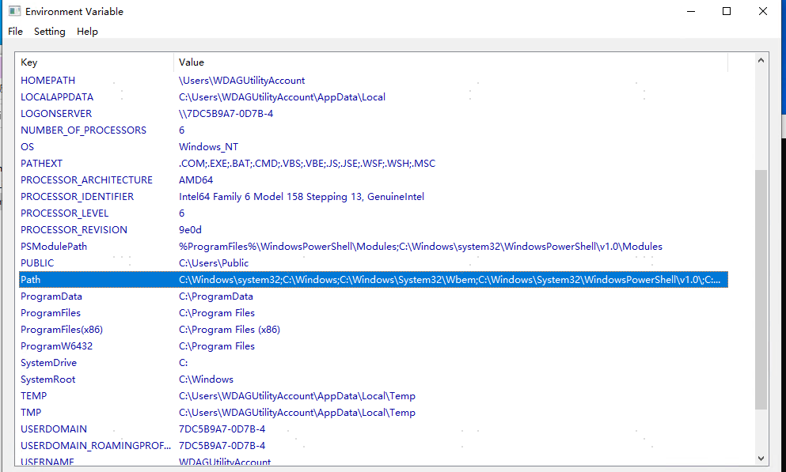

# WinEnvVar
a tiny win32 windows application, list all environment variable

### Features:
- List All Environment Variable
- View Path Line by Line
- Copy To Clipboard
- Export To File

### W.I.P
- Edit Environment Variable

### Snap 
